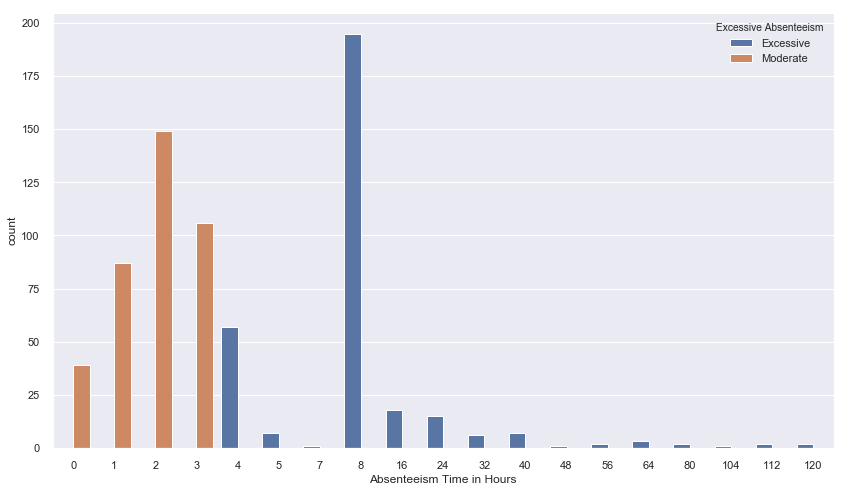
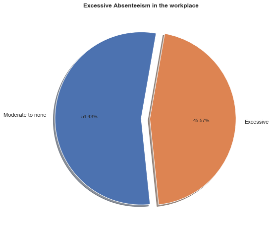
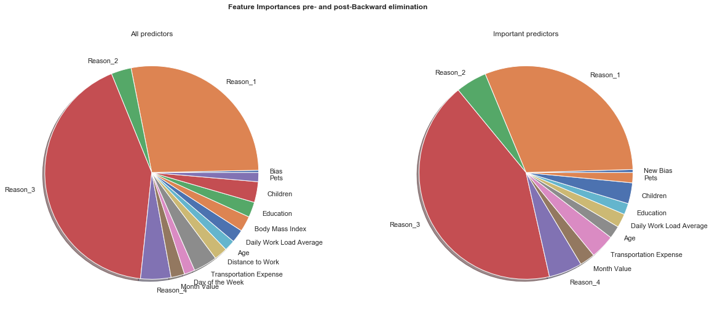

# Recap
### Summary of current progress:

In the previous article we **preprocessed** our absenteeism dataset by performing the following steps:

* Dropping the `ID` column (it contained no useful information for our upcoming analysis)
* Performed some exploratory analysis on the `Reason for absence` column, which contained integers describing the reasons for absenteeism. We performed `dummy encoding` and grouped the dummy variables into 4 classes: 
 * various diseases
 * pregnancy-related reasons
 * poisoning
 * light reasons
 and replaced the original column with four dummy-encoded reasons columns
* Split the date column into month and weekday columns
* Grouped the education column into two classes representing High School and Tertiary-level graduates respectively.
* Finally, we saved our preprocessed dataset as `absenteeism_data_preprocessed.csv` in our working directory.

### So, What's next?

Now, we would like to use our preprocessed data to build a regression model to help us predict whether or not absenteeism will occur given the inputs.

Specifically, we wish to build a logistic regression model

# Creating a logistic regression to predict absenteeism

We begin, again by mounting Google Drive so we can access our preprocessed data 


```python

import pandas as pd
import pandas_profiling
import numpy as np
import matplotlib.pyplot as plt
import seaborn as sns
sns.set('notebook')

from IPython.display import display, Image, SVG, Math, YouTubeVideo

%matplotlib inline

dataset ='preprocessed_absenteeism_data.csv'
raw = pd.read_csv(dataset) 
raw.sample(5)
```


<div>
<style scoped>
    .dataframe tbody tr th:only-of-type {
        vertical-align: middle;
    }

    .dataframe tbody tr th {
        vertical-align: top;
    }

    .dataframe thead th {
        text-align: right;
    }
</style>
<table border="1" class="dataframe">
  <thead>
    <tr style="text-align: right;">
      <th></th>
      <th>Reason_1</th>
      <th>Reason_2</th>
      <th>Reason_3</th>
      <th>Reason_4</th>
      <th>Month Value</th>
      <th>Day of the Week</th>
      <th>Transportation Expense</th>
      <th>Distance to Work</th>
      <th>Age</th>
      <th>Daily Work Load Average</th>
      <th>Body Mass Index</th>
      <th>Education</th>
      <th>Children</th>
      <th>Pets</th>
      <th>Absenteeism Time in Hours</th>
    </tr>
  </thead>
  <tbody>
    <tr>
      <th>529</th>
      <td>1</td>
      <td>0</td>
      <td>0</td>
      <td>0</td>
      <td>10</td>
      <td>6</td>
      <td>248</td>
      <td>25</td>
      <td>47</td>
      <td>284.853</td>
      <td>32</td>
      <td>0</td>
      <td>2</td>
      <td>1</td>
      <td>8</td>
    </tr>
    <tr>
      <th>418</th>
      <td>0</td>
      <td>0</td>
      <td>0</td>
      <td>1</td>
      <td>4</td>
      <td>2</td>
      <td>179</td>
      <td>51</td>
      <td>38</td>
      <td>239.409</td>
      <td>31</td>
      <td>0</td>
      <td>0</td>
      <td>0</td>
      <td>8</td>
    </tr>
    <tr>
      <th>130</th>
      <td>0</td>
      <td>0</td>
      <td>1</td>
      <td>0</td>
      <td>1</td>
      <td>1</td>
      <td>289</td>
      <td>36</td>
      <td>33</td>
      <td>308.593</td>
      <td>30</td>
      <td>0</td>
      <td>2</td>
      <td>1</td>
      <td>8</td>
    </tr>
    <tr>
      <th>422</th>
      <td>0</td>
      <td>0</td>
      <td>0</td>
      <td>1</td>
      <td>4</td>
      <td>4</td>
      <td>260</td>
      <td>50</td>
      <td>36</td>
      <td>239.409</td>
      <td>23</td>
      <td>0</td>
      <td>4</td>
      <td>0</td>
      <td>4</td>
    </tr>
    <tr>
      <th>484</th>
      <td>0</td>
      <td>0</td>
      <td>0</td>
      <td>1</td>
      <td>8</td>
      <td>1</td>
      <td>289</td>
      <td>36</td>
      <td>33</td>
      <td>249.797</td>
      <td>30</td>
      <td>0</td>
      <td>2</td>
      <td>1</td>
      <td>8</td>
    </tr>
  </tbody>
</table>
</div>


## The `Absenteeism Time in Hours` column

This is our target column, the variable we would like to predict.

Let's have a look at it

We would like to predict whether or not absenteeism occurs given our predictors. 

Thus, we can transform this column
into a classification containing binary values: `True` if absent and `False` if not absent.

How do we achieve that? 


```python
print('\033[1m' + 'Basic Stats' + '\033[0m')
abstimestats = raw['Absenteeism Time in Hours'].describe()
abstimestats
```

    Basic Stats


    count    700.000000
    mean       6.761429
    std       12.670082
    min        0.000000
    25%        2.000000
    50%        3.000000
    75%        8.000000
    max      120.000000
    Name: Absenteeism Time in Hours, dtype: float64


## Creating our targets

Let's create our targets for the regression.
We would like to have a binary classification telling us whethere or not an employee is excessively absent.

One way to achieve this is by mapping all values above a certain threshold amount of Absenteeism hours to 1 and the rest to 0.

The median can be used as our threshold as it automatically balances our data into 2 roughly equal classes


```python
med = abstimestats['50%'] # median = 50 percentile! 
print('The median is %d'%med)
targets = np.where(raw['Absenteeism Time in Hours']>med, 1, 0)
print('%5.2f%% of the targets are excessively absent. \nA 60/40 split\
 still counts as balanced!' %(100*sum(targets)/np.shape(targets)))
```

    The median is 3
    45.57% of the targets are excessively absent. 
    A 60/40 split still counts as balanced!


```python
Targs = pd.DataFrame(data=targets, columns=['Excessive Absenteeism'])
Targs.sample(6)
```


<div>
<style scoped>
    .dataframe tbody tr th:only-of-type {
        vertical-align: middle;
    }

    .dataframe tbody tr th {
        vertical-align: top;
    }

    .dataframe thead th {
        text-align: right;
    }
</style>
<table border="1" class="dataframe">
  <thead>
    <tr style="text-align: right;">
      <th></th>
      <th>Excessive Absenteeism</th>
    </tr>
  </thead>
  <tbody>
    <tr>
      <th>579</th>
      <td>1</td>
    </tr>
    <tr>
      <th>83</th>
      <td>1</td>
    </tr>
    <tr>
      <th>311</th>
      <td>0</td>
    </tr>
    <tr>
      <th>406</th>
      <td>0</td>
    </tr>
    <tr>
      <th>31</th>
      <td>1</td>
    </tr>
    <tr>
      <th>213</th>
      <td>0</td>
    </tr>
  </tbody>
</table>
</div>


```python
plt.rcParams['figure.figsize'] = (14.0, 8.0)
plt.xlabel('Absenteeism in Hours')
sns.countplot(raw['Absenteeism Time in Hours'], 
              hue=Targs['Excessive Absenteeism'].map({0:'Moderate', 1:'Excessive'}))
plt.show()

```





Thus, using logistic regression, we will classify employees into 2 categories:

**class 1:** Excessively absent $\leq median \leq$ **class 2:** moderately to non-absconding.

i.e We've decided that taking more than 3 hours off work is classified as excessive absenteeism, for our purposes...


```python

plt.pie(Targs['Excessive Absenteeism'].value_counts(),  explode=(0,0.1),
        labels=['Moderate to none', 'Excessive'], startangle=80, autopct='%1.2f%%', shadow=True)

plt.title('Excessive Absenteeism in the workplace', fontweight='bold')
plt.show()
```





### Selecting the inputs for regression:


```python
raw_inputs = raw.drop(['Absenteeism Time in Hours'], axis=1)
```

we could alternatively use `iloc` to slice the dataFrame, like so: 

`raw_inputs = df.iloc[:,:-1]`

where the first argument selects all rows and after the comma we are selecting all columns but the last one.

## Train/ Test Split

We divide our dataset into two parts:

* The Training set, on which we will train our model. This chunk is typically 70-80% of the entire dataset.

* The Validation/Test set, also known as the holdout set. This is the remainder of the data, the 'unseen' data on which we will test our model.

It is always a good idea to perform this step early on, specifically *before* any scaling to prevent any leakage of information between the train and test set.


```python
from sklearn.model_selection import train_test_split

X_train, X_test, y_train, y_test = train_test_split(raw_inputs, Targs, test_size=0.2, random_state=0)
```

## Standardizing the data:

### Why do we need to standardize our data?
Standardizing allows us to use one distribution (the [Normal distribution](https://en.wikipedia.org/wiki/Normal_distribution)) when comparing data with different units, ranges or other attributes (i.e [multivariate data](https://www.youtube.com/watch?v=uAxyI_XfqXk)). It also ensures that the data and results inferred therefrom are comparable with other datasets. Standardization works when the (random) variable, X is normally (N) distributed with mean $\mu$ and a variance of $\sigma^{2}$:
$$ X \sim N(\mu, \sigma^{2})$$

The result of standardizing X is a zero-mean ($\mu = 0$) data-set with a standard deviation of 1 ($\sigma =1$). 


Each observation's standardized score $z_{i} = \frac{x_{i} - \mu}{\sigma}$ (a.k.a z-score) tells us, based on the sign of $z (\pm)$, if the datapoint is below or above the mean, while the magnitude of $z$ tells us by how much.  


The above two points basically allow us to easily say how far from the *norm* a single observation is, i.e: whether it's 1 $\sigma$ (read 1 sigma, when z=1) or 3 $\sigma$ (z=3), etc. above or below the mean, ultimately allowing us to use a single model to evaluate the likelihood of any observation. 

Neglecting to standardize our data can have the effect of skewing the results of a ML algorithm towards, say, a feature with a large range but very litte importance to the model in reality!


--- 


##### To Standardize or not to standardize? 


In the context of ML Engineering, standardization helps with model accuracy; statisticians, BI analysts and other businessfolk on the other hand prioritise model interpretability since they are more concerned with the driving forces behind the phenomena covered by our models, and thus will often opt for no standardization.

The decision to standardize or not to standardize ultimately depends on the data scientist/analyst, informed by their ultimate requirements with the data. Some machine learning algorithms' solvers also penalise unscaled data, thus in the interest of accuracy, one may opt to either standardize or create analyses covering both scenarios, which would be simplified by the use of a [pipeline](https://scikit-learn.org/stable/modules/generated/sklearn.pipeline.Pipeline.html). 
 

--- 

This topic could be an entire post on its own, but this is the gist of it.

**TLDR:** Standardization tells us the average spread of the observations from the mean of the feature, and it is useful for comparing different features and datasets. In short: 🍏🍊 $\underrightarrow{\mbox{standardization}}$ 🍎🍏.


For further browsing, try [This Quora question and answers](https://www.quora.com/Why-is-it-useful-to-standardize-a-variable), [This Humans of data article](https://humansofdata.atlan.com/2018/12/data-standardization/) and [One of a ton of Medium articles on the topic](https://medium.com/@joelvarmadirisam/my-take-on-why-do-we-need-to-standardize-the-data-1459e6608a63).

---


Now, we are building a binary classifier, there are some columns which are already binary (0,1) and will not need scaling in our dataset


```python
from sklearn.preprocessing import StandardScaler
from sklearn.compose import ColumnTransformer

#exclude = [i for i in X_train.columns if np.all(X_train[i].unique() in np.array([0,1])) or np.all(X_train[i].unique() in np.array([1,0]))]
exclude = [i for i in X_train.columns if X_train[i].nunique()==2 ]

print('Standardize all inputs except:\n', exclude, '\n\n')

#The columns we WILL be scaling are:

to_scale = [col for col in X_train.columns if col not in exclude]
#print(to_scale, '\n')

coltrans = ColumnTransformer(
      remainder = 'passthrough', #ignore the unspecified columns, without dropping them
      transformers=[('scale', StandardScaler(), to_scale)]
      )  

X_train = X_train.astype(float) # StandardScaler expects all data to have dtype=float64  
# ColumnTransformer still moves the unscaled columns to the end. We must recover the original column order
X_train_scaled = pd.DataFrame(data=coltrans.fit_transform(X_train), columns=to_scale+exclude)[X_train.columns]

print('\033[1m'+'\nOur Predictors, after scaling:\n'+'\033[0m' )
X_train_scaled.head()
```

    Standardize all inputs except:
     ['Reason_1', 'Reason_2', 'Reason_3', 'Reason_4', 'Education'] 
    
    
    
    Our Predictors, after scaling:
    


<div>
<style scoped>
    .dataframe tbody tr th:only-of-type {
        vertical-align: middle;
    }

    .dataframe tbody tr th {
        vertical-align: top;
    }

    .dataframe thead th {
        text-align: right;
    }
</style>
<table border="1" class="dataframe">
  <thead>
    <tr style="text-align: right;">
      <th></th>
      <th>Reason_1</th>
      <th>Reason_2</th>
      <th>Reason_3</th>
      <th>Reason_4</th>
      <th>Month Value</th>
      <th>Day of the Week</th>
      <th>Transportation Expense</th>
      <th>Distance to Work</th>
      <th>Age</th>
      <th>Daily Work Load Average</th>
      <th>Body Mass Index</th>
      <th>Education</th>
      <th>Children</th>
      <th>Pets</th>
    </tr>
  </thead>
  <tbody>
    <tr>
      <th>0</th>
      <td>0.0</td>
      <td>0.0</td>
      <td>0.0</td>
      <td>1.0</td>
      <td>0.772843</td>
      <td>2.682111</td>
      <td>-1.563951</td>
      <td>-1.372249</td>
      <td>0.100137</td>
      <td>-0.773124</td>
      <td>0.280561</td>
      <td>0.0</td>
      <td>-0.912335</td>
      <td>-0.585103</td>
    </tr>
    <tr>
      <th>1</th>
      <td>0.0</td>
      <td>0.0</td>
      <td>0.0</td>
      <td>0.0</td>
      <td>0.772843</td>
      <td>0.647824</td>
      <td>0.178263</td>
      <td>-0.698398</td>
      <td>1.045247</td>
      <td>0.556297</td>
      <td>2.587672</td>
      <td>0.0</td>
      <td>0.003270</td>
      <td>-0.585103</td>
    </tr>
    <tr>
      <th>2</th>
      <td>0.0</td>
      <td>0.0</td>
      <td>0.0</td>
      <td>1.0</td>
      <td>1.056269</td>
      <td>-0.708368</td>
      <td>-0.655617</td>
      <td>1.390539</td>
      <td>0.257655</td>
      <td>-0.470922</td>
      <td>0.972694</td>
      <td>0.0</td>
      <td>-0.912335</td>
      <td>-0.585103</td>
    </tr>
    <tr>
      <th>3</th>
      <td>0.0</td>
      <td>0.0</td>
      <td>0.0</td>
      <td>1.0</td>
      <td>-1.211142</td>
      <td>1.325919</td>
      <td>-0.655617</td>
      <td>1.390539</td>
      <td>0.257655</td>
      <td>-0.512437</td>
      <td>0.972694</td>
      <td>0.0</td>
      <td>-0.912335</td>
      <td>-0.585103</td>
    </tr>
    <tr>
      <th>4</th>
      <td>0.0</td>
      <td>1.0</td>
      <td>0.0</td>
      <td>0.0</td>
      <td>-0.644289</td>
      <td>-0.708368</td>
      <td>0.178263</td>
      <td>-0.967938</td>
      <td>-0.687455</td>
      <td>-0.651830</td>
      <td>-0.411572</td>
      <td>1.0</td>
      <td>-0.912335</td>
      <td>-0.585103</td>
    </tr>
  </tbody>
</table>
</div>


---

## The Logistic Regression

We can finally perform our logistic regression!


```python
from sklearn.linear_model import LogisticRegression
from sklearn import metrics
```

### Let's define and train our model  


```python
logreg = LogisticRegression(solver='newton-cg')
logreg.fit(X_train_scaled, y_train.to_numpy().ravel())
```


    LogisticRegression(C=1.0, class_weight=None, dual=False, fit_intercept=True,
              intercept_scaling=1, max_iter=100, multi_class='warn',
              n_jobs=None, penalty='l2', random_state=None, solver='newton-cg',
              tol=0.0001, verbose=0, warm_start=False)


# Predictions and interpretability
## Predictions:
Let's see what our model's predictions are, by running `model.predict` on our `holdout set` predictors.

**NB:** Let's not forget to standardize our test set first!

**Ps:** We fit our scaler on the training set only, to teach our model 
the training set's $\mu$ and $\sigma$: $$X\_train\_scaled = \frac{X_{i}- \mu_{train}}{\sigma_{train}}$$.
The `.fit_transform` method immediately transforms (scales) our training set after fitting.
`X_train_scaled = scaler.fit_transform(X_train)`.
Learning MUST only take place within the training set.

After the model has learned the values of $\mu$ and $\sigma$ from the training set, we use the fitted model to transform the holdout set using: $$X\_test\_scaled = \frac{X_{i}- \mu_{train}}{\sigma_{train}}$$

or `X_test_scaled = scaler.transform(X_test)` 

for each column.


See, for example, discussions from [sebastianraschka.com](https://sebastianraschka.com/faq/docs/scale-training-test.html), [Data Science Stack Exchange](https://datascience.stackexchange.com/questions/38395/standardscaler-before-and-after-splitting-data) and [Matthew Drury's answer on Statistics Stack Exchange](https://stats.stackexchange.com/questions/319514/why-feature-scaling-only-to-training-set) for more info on the subject

`y_pred = logreg.predict(X_test_scaled)` gives us our model's predictions


```python
X_test_scaled = pd.DataFrame(data=coltrans.transform(X_test.astype(float)), columns=to_scale+exclude)[X_test.columns]
y_pred = pd.DataFrame(data=(logreg.predict(X_test_scaled)), columns=y_test.columns.values)
y_pred.sample(5)

```


<div>
<style scoped>
    .dataframe tbody tr th:only-of-type {
        vertical-align: middle;
    }

    .dataframe tbody tr th {
        vertical-align: top;
    }

    .dataframe thead th {
        text-align: right;
    }
</style>
<table border="1" class="dataframe">
  <thead>
    <tr style="text-align: right;">
      <th></th>
      <th>Excessive Absenteeism</th>
    </tr>
  </thead>
  <tbody>
    <tr>
      <th>138</th>
      <td>0</td>
    </tr>
    <tr>
      <th>84</th>
      <td>1</td>
    </tr>
    <tr>
      <th>73</th>
      <td>0</td>
    </tr>
    <tr>
      <th>16</th>
      <td>1</td>
    </tr>
    <tr>
      <th>48</th>
      <td>1</td>
    </tr>
  </tbody>
</table>
</div>


## Model Accuracy

The model accuracy is calculated by comparing the predictions in `y_pred` with the `holdout` target column.

Let's see how our model performs on the training and testing predictors respectively. A good model doesn't do significantly worse on the test set, if it does, we've overfit. 

The inverse, though, doesn't make much sense. However, a marginal 'improvement' in accuracy is possible due to randomness.


```python
print('\033[1m'+'Train Accuracy:'+'\033[0m', logreg.score(X_train_scaled, y_train)) # Train score 
print('\033[1m'+'Test Accuracy:'+'\033[0m', logreg.score(X_test_scaled, y_test)) # Train score 
# Let's Manually calculate the test accuracy....
manual_test_accuracy = (sum(y_pred.to_numpy()==y_test.to_numpy())/np.shape(y_pred.to_numpy()))[0]
print('\033[1m'+'Manual Test Accuracy:'+'\033[0m', manual_test_accuracy)
```

    Train Accuracy: 0.7589285714285714
    Test Accuracy: 0.7642857142857142
    Manual Test Accuracy: 0.7642857142857142


## The Weights and Bias

The objective of Regression analysis is to determine the weights (coefficients) and bias, which we then apply to the predictors (inputs) to obtain our predictions (the final result).

$$ \gamma = \beta_{0} + \beta_{1}x_{1} + \beta_{2}x_{2} + ... + \beta_{n}x_{n} + \epsilon $$

where $ \gamma$ is the predicted output

$\beta_{0}$ is the bias (intercept in math)

$\beta_{k}, 1 \leq k \leq n$ are the weights


```python
logreg.coef_ # Each predictor's coefficient
```


    array([[ 2.6719901 ,  0.46065513,  3.09032814,  0.87137457,  0.07028897,
            -0.17395212,  0.62522164,  0.05633776, -0.1554372 ,  0.0393792 ,
             0.20286036,  0.18514474,  0.49220729, -0.33276522]])


```python
logreg.intercept_[0] # bias
```


    -1.7037491273882583


### Interpretation of the weights and bias


The way these coefficients are displayed here makes it quite hard to match up the inputs to their coefficients.

Also, since we are dealing with a logistic regression model the equation actually looks like this:

$$ \gamma = log(odds) = \beta_{0} + \beta_{1}x_{1} + \beta_{2}x_{2} + ... + \beta_{n}x_{n} + \epsilon $$

And since we are interested in finding the odds of excessive absenteeism occurring:

$$odds = e^{log(odds)}$$


Let's create a summary table:


```python
summary_table = pd.DataFrame(data=X_train_scaled.columns.values, columns=['Feature name'])
summary_table['Weight'] = np.transpose(logreg.coef_) # Convert the coefficients into columns
#display(summary_table)

# To add the intercept to the beginning of the summary table:
summary_table.index +=1 # shift the indices down by one 
#display(summary_table) # Space has been created for the intercept to be prepended
summary_table.loc[0] = ['Bias', logreg.intercept_[0]]
summary_table = summary_table.sort_index()

summary_table['Odds_ratio'] = np.exp(summary_table['Weight'])
summary_table['importance'] = [(100*abs(1-abs(i))/(abs(1-abs(summary_table.Odds_ratio[3])))) for i in summary_table.Odds_ratio]
summary_table.sort_values('importance', ascending=False)

```


<div>
<style scoped>
    .dataframe tbody tr th:only-of-type {
        vertical-align: middle;
    }

    .dataframe tbody tr th {
        vertical-align: top;
    }

    .dataframe thead th {
        text-align: right;
    }
</style>
<table border="1" class="dataframe">
  <thead>
    <tr style="text-align: right;">
      <th></th>
      <th>Feature name</th>
      <th>Weight</th>
      <th>Odds_ratio</th>
      <th>importance</th>
    </tr>
  </thead>
  <tbody>
    <tr>
      <th>3</th>
      <td>Reason_3</td>
      <td>3.090328</td>
      <td>21.984291</td>
      <td>100.000000</td>
    </tr>
    <tr>
      <th>1</th>
      <td>Reason_1</td>
      <td>2.671990</td>
      <td>14.468735</td>
      <td>64.184847</td>
    </tr>
    <tr>
      <th>4</th>
      <td>Reason_4</td>
      <td>0.871375</td>
      <td>2.390194</td>
      <td>6.624928</td>
    </tr>
    <tr>
      <th>7</th>
      <td>Transportation Expense</td>
      <td>0.625222</td>
      <td>1.868660</td>
      <td>4.139573</td>
    </tr>
    <tr>
      <th>0</th>
      <td>Bias</td>
      <td>-1.703749</td>
      <td>0.182000</td>
      <td>3.898155</td>
    </tr>
    <tr>
      <th>13</th>
      <td>Children</td>
      <td>0.492207</td>
      <td>1.635923</td>
      <td>3.030473</td>
    </tr>
    <tr>
      <th>2</th>
      <td>Reason_2</td>
      <td>0.460655</td>
      <td>1.585112</td>
      <td>2.788334</td>
    </tr>
    <tr>
      <th>14</th>
      <td>Pets</td>
      <td>-0.332765</td>
      <td>0.716938</td>
      <td>1.348921</td>
    </tr>
    <tr>
      <th>11</th>
      <td>Body Mass Index</td>
      <td>0.202860</td>
      <td>1.224901</td>
      <td>1.071761</td>
    </tr>
    <tr>
      <th>12</th>
      <td>Education</td>
      <td>0.185145</td>
      <td>1.203393</td>
      <td>0.969261</td>
    </tr>
    <tr>
      <th>6</th>
      <td>Day of the Week</td>
      <td>-0.173952</td>
      <td>0.840337</td>
      <td>0.760869</td>
    </tr>
    <tr>
      <th>9</th>
      <td>Age</td>
      <td>-0.155437</td>
      <td>0.856041</td>
      <td>0.686033</td>
    </tr>
    <tr>
      <th>5</th>
      <td>Month Value</td>
      <td>0.070289</td>
      <td>1.072818</td>
      <td>0.347013</td>
    </tr>
    <tr>
      <th>8</th>
      <td>Distance to Work</td>
      <td>0.056338</td>
      <td>1.057955</td>
      <td>0.276183</td>
    </tr>
    <tr>
      <th>10</th>
      <td>Daily Work Load Average</td>
      <td>0.039379</td>
      <td>1.040165</td>
      <td>0.191404</td>
    </tr>
  </tbody>
</table>
</div>


Now we have our coefficients sorted from most to least important.
A weight $\beta_{k}$ of zero (or close to 0) $\implies$ the feature will not impact the model by much.
Conversely, a larger weight means that the model depends more heavily on that feature. This is intuitive.

The odds ratio on the other hand:
$$
Odds \times odds\_ratio = \mbox{new odds}
$$
i.e if odds are 3:1 

and $ odds\_ratio  = 2$ 

then new odds = 6:1

for a unit change (change of 1)

If odds_ratio = 1, odds = new odds. 

Thus, the closer a predictor's odds_ratio is to 1, the lower its significance to the model.
We would like to know how important each of our predictors are to the model and its predictions. The weights / Odds ratio offer a crude way of evaluating this. However, for a quick ranking of the predictors, I included an arbitrarily defined *importance* column, with no meaning beyond being a ranking aid. In this column, the importance by the absolute value of each feature's difference with 1, displayed as a percentage of the highest-importance predictor.

Feature Importance provides a much more straightforward and less fluffy way of achieving this...

# Feature Importance

The Permutation Importance of a feature is calculated randomly shuffling the feature's rows and checking how much the model's prediction accuracy on the hold out set deteriorates as a result. This is done for each feature without changing any of the other columns. This shuffling and model performance evaluation (by calculating how much the loss function suffers per shuffle) is performed multiple times for each feature, to account for randomness.
The final value reported is the average importance weight $\pm$ the standard deviation, or the range of variation of the importance weights each time the shuffling is performed. 

Now, shuffling a predictor's rows should result in less accurate model predictions, for obvious reasons. 
Thus, the feature importances are calculated by how negatively shuffling them affects the model.

`eli5` does this very thing in no more than 4 lines of code!


```python
!pip install eli5
import eli5
from eli5.sklearn import PermutationImportance
perm = PermutationImportance(logreg, random_state=0).fit(X_train_scaled, y_train)

eli5.show_weights(perm, feature_names=X_train_scaled.columns.tolist())
```

    Requirement already satisfied: eli5 in /Users/clemence/anaconda3/lib/python3.7/site-packages (0.9.0)
    Requirement already satisfied: jinja2 in /Users/clemence/anaconda3/lib/python3.7/site-packages (from eli5) (2.10)
    Requirement already satisfied: scikit-learn>=0.18 in /Users/clemence/anaconda3/lib/python3.7/site-packages (from eli5) (0.20.3)
    Requirement already satisfied: numpy>=1.9.0 in /Users/clemence/anaconda3/lib/python3.7/site-packages (from eli5) (1.17.2)
    Requirement already satisfied: typing in /Users/clemence/anaconda3/lib/python3.7/site-packages (from eli5) (3.6.4)
    Requirement already satisfied: six in /Users/clemence/anaconda3/lib/python3.7/site-packages (from eli5) (1.12.0)
    Requirement already satisfied: graphviz in /Users/clemence/anaconda3/lib/python3.7/site-packages (from eli5) (0.11.1)
    Requirement already satisfied: scipy in /Users/clemence/anaconda3/lib/python3.7/site-packages (from eli5) (1.2.1)
    Requirement already satisfied: tabulate>=0.7.7 in /Users/clemence/anaconda3/lib/python3.7/site-packages (from eli5) (0.8.3)
    Requirement already satisfied: attrs>16.0.0 in /Users/clemence/anaconda3/lib/python3.7/site-packages (from eli5) (19.1.0)
    Requirement already satisfied: MarkupSafe>=0.23 in /Users/clemence/anaconda3/lib/python3.7/site-packages (from jinja2->eli5) (1.1.1)


    <style>
    table.eli5-weights tr:hover {
        filter: brightness(85%);
    }
</style>


    

    

    

    

    

    


    

    

    

    

    

    


    

    

    

    

    
        <table class="eli5-weights eli5-feature-importances" style="border-collapse: collapse; border: none; margin-top: 0em; table-layout: auto;">
    <thead>
    <tr style="border: none;">
        <th style="padding: 0 1em 0 0.5em; text-align: right; border: none;">Weight</th>
        <th style="padding: 0 0.5em 0 0.5em; text-align: left; border: none;">Feature</th>
    </tr>
    </thead>
    <tbody>
    
        <tr style="background-color: hsl(120, 100.00%, 80.00%); border: none;">
            <td style="padding: 0 1em 0 0.5em; text-align: right; border: none;">
                0.1446
                
                    &plusmn; 0.0168
                
            </td>
            <td style="padding: 0 0.5em 0 0.5em; text-align: left; border: none;">
                Reason_1
            </td>
        </tr>
    
        <tr style="background-color: hsl(120, 100.00%, 87.12%); border: none;">
            <td style="padding: 0 1em 0 0.5em; text-align: right; border: none;">
                0.0771
                
                    &plusmn; 0.0167
                
            </td>
            <td style="padding: 0 0.5em 0 0.5em; text-align: left; border: none;">
                Reason_3
            </td>
        </tr>
    
        <tr style="background-color: hsl(120, 100.00%, 90.59%); border: none;">
            <td style="padding: 0 1em 0 0.5em; text-align: right; border: none;">
                0.0493
                
                    &plusmn; 0.0080
                
            </td>
            <td style="padding: 0 0.5em 0 0.5em; text-align: left; border: none;">
                Transportation Expense
            </td>
        </tr>
    
        <tr style="background-color: hsl(120, 100.00%, 92.12%); border: none;">
            <td style="padding: 0 1em 0 0.5em; text-align: right; border: none;">
                0.0382
                
                    &plusmn; 0.0062
                
            </td>
            <td style="padding: 0 0.5em 0 0.5em; text-align: left; border: none;">
                Children
            </td>
        </tr>
    
        <tr style="background-color: hsl(120, 100.00%, 94.99%); border: none;">
            <td style="padding: 0 1em 0 0.5em; text-align: right; border: none;">
                0.0200
                
                    &plusmn; 0.0142
                
            </td>
            <td style="padding: 0 0.5em 0 0.5em; text-align: left; border: none;">
                Reason_4
            </td>
        </tr>
    
        <tr style="background-color: hsl(120, 100.00%, 96.25%); border: none;">
            <td style="padding: 0 1em 0 0.5em; text-align: right; border: none;">
                0.0132
                
                    &plusmn; 0.0105
                
            </td>
            <td style="padding: 0 0.5em 0 0.5em; text-align: left; border: none;">
                Pets
            </td>
        </tr>
    
        <tr style="background-color: hsl(120, 100.00%, 97.31%); border: none;">
            <td style="padding: 0 1em 0 0.5em; text-align: right; border: none;">
                0.0082
                
                    &plusmn; 0.0048
                
            </td>
            <td style="padding: 0 0.5em 0 0.5em; text-align: left; border: none;">
                Age
            </td>
        </tr>
    
        <tr style="background-color: hsl(120, 100.00%, 98.83%); border: none;">
            <td style="padding: 0 1em 0 0.5em; text-align: right; border: none;">
                0.0025
                
                    &plusmn; 0.0062
                
            </td>
            <td style="padding: 0 0.5em 0 0.5em; text-align: left; border: none;">
                Education
            </td>
        </tr>
    
        <tr style="background-color: hsl(120, 100.00%, 99.08%); border: none;">
            <td style="padding: 0 1em 0 0.5em; text-align: right; border: none;">
                0.0018
                
                    &plusmn; 0.0078
                
            </td>
            <td style="padding: 0 0.5em 0 0.5em; text-align: left; border: none;">
                Daily Work Load Average
            </td>
        </tr>
    
        <tr style="background-color: hsl(120, 100.00%, 99.08%); border: none;">
            <td style="padding: 0 1em 0 0.5em; text-align: right; border: none;">
                0.0018
                
                    &plusmn; 0.0023
                
            </td>
            <td style="padding: 0 0.5em 0 0.5em; text-align: left; border: none;">
                Reason_2
            </td>
        </tr>
    
        <tr style="background-color: hsl(0, 100.00%, 99.51%); border: none;">
            <td style="padding: 0 1em 0 0.5em; text-align: right; border: none;">
                -0.0007
                
                    &plusmn; 0.0017
                
            </td>
            <td style="padding: 0 0.5em 0 0.5em; text-align: left; border: none;">
                Month Value
            </td>
        </tr>
    
        <tr style="background-color: hsl(0, 100.00%, 99.51%); border: none;">
            <td style="padding: 0 1em 0 0.5em; text-align: right; border: none;">
                -0.0007
                
                    &plusmn; 0.0129
                
            </td>
            <td style="padding: 0 0.5em 0 0.5em; text-align: left; border: none;">
                Day of the Week
            </td>
        </tr>
    
        <tr style="background-color: hsl(0, 100.00%, 99.35%); border: none;">
            <td style="padding: 0 1em 0 0.5em; text-align: right; border: none;">
                -0.0011
                
                    &plusmn; 0.0066
                
            </td>
            <td style="padding: 0 0.5em 0 0.5em; text-align: left; border: none;">
                Distance to Work
            </td>
        </tr>
    
        <tr style="background-color: hsl(0, 100.00%, 98.72%); border: none;">
            <td style="padding: 0 1em 0 0.5em; text-align: right; border: none;">
                -0.0029
                
                    &plusmn; 0.0161
                
            </td>
            <td style="padding: 0 0.5em 0 0.5em; text-align: left; border: none;">
                Body Mass Index
            </td>
        </tr>
    
    
    </tbody>
</table>
    

    


    

    

    

    

    

    


### Interpretation:

Permutation importances are displayed in descending order. 

The weights are reported with an uncertainty denoting how much the base weight varied per shuffle.

Some of the features' reported weights are negative. Does that mean the model's loss function **improved** after random shuffling of the column?

**yes and no**. Rather, this is a result of happenstance: such features have very low permutation importances and due to random noise, the shuffled data's predictions happen to be slightly more accurate than the unshuffled validation data. This issue is less common with larger datasets, where there is less room for chance. (recall: this dataset has only 700 observaions!)

---

Anyway, we see, from our permutation importances, that Reasons 1 and 3, followed by Transport expense and number of Children have the biggest impact on Absenteeism.  

# Backward Elimination


 is where we simplify our model by removing the low-importance features (with weights $\approx 0$ or odds ratio $\approx 1$)


The `Day of the Week`, `Distance to work`, `Body Mass Index` and `Month` appear to be three such features, according to the Permutation Importance Table. 

--- 

Let's re-train our model without these features and see if a simplified model performs any better.


```python
# Drop unimportant features from a checkpoint variable. Let's remove variables with importances < 10% of highest importance
eliminate = ['Distance to Work', 'Month', 'Body Mass Index', 'Day of the Week']
#`Day of the Week`, `Distance to work`, `Body Mass Index` and `Month`
#eliminate = ['Absenteeism Time in Hours','Day of the Week', 'Daily Work Load Average','Distance to Work']
feat = raw_inputs.drop([i for i in eliminate if i in raw_inputs], axis=1)

# Train/test split
X_tr, X_te, y_tr, y_te = train_test_split(feat, Targs, test_size=0.2, random_state=0, stratify=Targs)

# Select the columns to standardize
#incl = [i for i in X_tr.columns if np.all(X_tr[i].unique() != np.array([0,1])) and np.all(X_tr[i].unique() != np.array([1,0]))]
incl = [i for i in X_tr.columns if X_tr[i].nunique()!=2 ]
excl = [i for i in X_tr.columns if i not in incl]
#standardize
coltransformer = ColumnTransformer(remainder = 'passthrough', transformers=[('scale', StandardScaler(), incl)])
X_tr_scaled = pd.DataFrame(data=coltransformer.fit_transform(X_tr.astype(float)), columns=incl+excl)[X_tr.columns] # scale train predictors
X_te_scaled = pd.DataFrame(data=coltransformer.transform(X_te.astype(float)), columns=incl+excl)[X_te.columns] #scale test predictors

### Retrain the model with less features:
logreg_new = LogisticRegression(solver='newton-cg')
logreg_new.fit(X_tr_scaled, y_tr.to_numpy().ravel())

```


    LogisticRegression(C=1.0, class_weight=None, dual=False, fit_intercept=True,
              intercept_scaling=1, max_iter=100, multi_class='warn',
              n_jobs=None, penalty='l2', random_state=None, solver='newton-cg',
              tol=0.0001, verbose=0, warm_start=False)


```python
from IPython.display import display_html
def display_side_by_side(*args):
    html_str=''
    for df in args:
        html_str+=df.to_html()
    display_html(html_str.replace('table','table style="display:inline"'),raw=True)

# Summary Table COmparison
summary_table2 = pd.DataFrame(data=X_tr_scaled.columns.values, columns=['Feature name'])
summary_table2['New Weight'] = np.transpose(logreg_new.coef_) # Convert the coefficients into columns


# To add the intercept to the beginning of the summary table:
summary_table2.index +=1 # shift the indices down by one 
# display(summary_table2) # Space has been created for the intercept to be prepended
summary_table2.loc[0] = ['New Bias', logreg_new.intercept_[0]]
summary_table2 = summary_table2.sort_index()
summary_table2['New Odds_ratio'] = np.exp(summary_table2['New Weight'])


summary_table2['New importance'] = [(abs(1-abs(i))/max(abs(1-abs(summary_table2['New Odds_ratio'])))) for i in summary_table2['New Odds_ratio']]
from IPython.display import display, HTML


# credit: https://stackoverflow.com/questions/38783027/jupyter-notebook-display-two-pandas-tables-side-by-side
display_side_by_side(summary_table.sort_values('importance', ascending=False), 
                     summary_table2.sort_values('New importance', ascending=False))

print('\n------------------------------------------------------------------------------------------------------\n')
plt.rcParams['figure.figsize'] = (18.0, 9.0)
f = plt.figure(figsize=(20,8))
f.suptitle('Feature Importances pre- and post-Backward elimination', fontweight='bold')
ax = f.add_subplot(121)
ax.set_title('All predictors')
ax.pie(summary_table['Odds_ratio'], labels=summary_table['Feature name'], shadow=True)

ax2 = f.add_subplot(122)
ax2.set_title('Important predictors')
ax2.pie(summary_table2['New Odds_ratio'], labels=summary_table2['Feature name'], shadow=True)
plt.show()

```


<table style="display:inline" border="1" class="dataframe">
  <thead>
    <tr style="text-align: right;">
      <th></th>
      <th>Feature name</th>
      <th>Weight</th>
      <th>Odds_ratio</th>
      <th>importance</th>
    </tr>
  </thead>
  <tbody>
    <tr>
      <th>3</th>
      <td>Reason_3</td>
      <td>3.090328</td>
      <td>21.984291</td>
      <td>100.000000</td>
    </tr>
    <tr>
      <th>1</th>
      <td>Reason_1</td>
      <td>2.671990</td>
      <td>14.468735</td>
      <td>64.184847</td>
    </tr>
    <tr>
      <th>4</th>
      <td>Reason_4</td>
      <td>0.871375</td>
      <td>2.390194</td>
      <td>6.624928</td>
    </tr>
    <tr>
      <th>7</th>
      <td>Transportation Expense</td>
      <td>0.625222</td>
      <td>1.868660</td>
      <td>4.139573</td>
    </tr>
    <tr>
      <th>0</th>
      <td>Bias</td>
      <td>-1.703749</td>
      <td>0.182000</td>
      <td>3.898155</td>
    </tr>
    <tr>
      <th>13</th>
      <td>Children</td>
      <td>0.492207</td>
      <td>1.635923</td>
      <td>3.030473</td>
    </tr>
    <tr>
      <th>2</th>
      <td>Reason_2</td>
      <td>0.460655</td>
      <td>1.585112</td>
      <td>2.788334</td>
    </tr>
    <tr>
      <th>14</th>
      <td>Pets</td>
      <td>-0.332765</td>
      <td>0.716938</td>
      <td>1.348921</td>
    </tr>
    <tr>
      <th>11</th>
      <td>Body Mass Index</td>
      <td>0.202860</td>
      <td>1.224901</td>
      <td>1.071761</td>
    </tr>
    <tr>
      <th>12</th>
      <td>Education</td>
      <td>0.185145</td>
      <td>1.203393</td>
      <td>0.969261</td>
    </tr>
    <tr>
      <th>6</th>
      <td>Day of the Week</td>
      <td>-0.173952</td>
      <td>0.840337</td>
      <td>0.760869</td>
    </tr>
    <tr>
      <th>9</th>
      <td>Age</td>
      <td>-0.155437</td>
      <td>0.856041</td>
      <td>0.686033</td>
    </tr>
    <tr>
      <th>5</th>
      <td>Month Value</td>
      <td>0.070289</td>
      <td>1.072818</td>
      <td>0.347013</td>
    </tr>
    <tr>
      <th>8</th>
      <td>Distance to Work</td>
      <td>0.056338</td>
      <td>1.057955</td>
      <td>0.276183</td>
    </tr>
    <tr>
      <th>10</th>
      <td>Daily Work Load Average</td>
      <td>0.039379</td>
      <td>1.040165</td>
      <td>0.191404</td>
    </tr>
  </tbody>
</table style="display:inline"><table style="display:inline" border="1" class="dataframe">
  <thead>
    <tr style="text-align: right;">
      <th></th>
      <th>Feature name</th>
      <th>New Weight</th>
      <th>New Odds_ratio</th>
      <th>New importance</th>
    </tr>
  </thead>
  <tbody>
    <tr>
      <th>3</th>
      <td>Reason_3</td>
      <td>2.961844</td>
      <td>19.333600</td>
      <td>1.000000</td>
    </tr>
    <tr>
      <th>1</th>
      <td>Reason_1</td>
      <td>2.637040</td>
      <td>13.971785</td>
      <td>0.707542</td>
    </tr>
    <tr>
      <th>4</th>
      <td>Reason_4</td>
      <td>0.829414</td>
      <td>2.291976</td>
      <td>0.070470</td>
    </tr>
    <tr>
      <th>2</th>
      <td>Reason_2</td>
      <td>0.757981</td>
      <td>2.133963</td>
      <td>0.061852</td>
    </tr>
    <tr>
      <th>0</th>
      <td>New Bias</td>
      <td>-1.564642</td>
      <td>0.209163</td>
      <td>0.043136</td>
    </tr>
    <tr>
      <th>6</th>
      <td>Transportation Expense</td>
      <td>0.515215</td>
      <td>1.673999</td>
      <td>0.036763</td>
    </tr>
    <tr>
      <th>10</th>
      <td>Children</td>
      <td>0.363538</td>
      <td>1.438410</td>
      <td>0.023913</td>
    </tr>
    <tr>
      <th>11</th>
      <td>Pets</td>
      <td>-0.359347</td>
      <td>0.698132</td>
      <td>0.016465</td>
    </tr>
    <tr>
      <th>9</th>
      <td>Education</td>
      <td>-0.258105</td>
      <td>0.772514</td>
      <td>0.012408</td>
    </tr>
    <tr>
      <th>7</th>
      <td>Age</td>
      <td>-0.138842</td>
      <td>0.870366</td>
      <td>0.007071</td>
    </tr>
    <tr>
      <th>5</th>
      <td>Month Value</td>
      <td>0.053033</td>
      <td>1.054464</td>
      <td>0.002971</td>
    </tr>
    <tr>
      <th>8</th>
      <td>Daily Work Load Average</td>
      <td>-0.050169</td>
      <td>0.951069</td>
      <td>0.002669</td>
    </tr>
  </tbody>
</table style="display:inline">


    
    ------------------------------------------------------------------------------------------------------
    





```python
trsc = 100*logreg.score(X_train_scaled, y_train)
tsst = 100*logreg.score(X_test_scaled, y_test)
trsc_new = 100*logreg_new.score(X_tr_scaled, y_tr)
tsst_new = 100*logreg_new.score(X_te_scaled, y_te)
print('\033[1m'+'New Accuracies:'+'\033[0m'+'\nTrain Accuracy= %.2f%%\t Test Accuracy = %5.3f%%' %(trsc_new, trsc_new))
print('\033[1m'+'Old Accuracies:'+'\033[0m'+'\nTrain Accuracy= %.2f%%\t Test Accuracy = %5.3f%%\
      \n --------------------------------------------------------------\n' %(trsc, tsst))

score_table = pd.DataFrame(data=[trsc, tsst], columns=['old score'])
score_table['new score'] = [trsc_new, tsst_new]
score_table.index = ['train accuracy', 'test accuracy']
score_table
```

    New Accuracies:
    Train Accuracy= 74.64%	 Test Accuracy = 74.643%
    Old Accuracies:
    Train Accuracy= 75.89%	 Test Accuracy = 76.429%      
     --------------------------------------------------------------
    


<div>
<style scoped>
    .dataframe tbody tr th:only-of-type {
        vertical-align: middle;
    }

    .dataframe tbody tr th {
        vertical-align: top;
    }

    .dataframe thead th {
        text-align: right;
    }
</style>
<table border="1" class="dataframe">
  <thead>
    <tr style="text-align: right;">
      <th></th>
      <th>old score</th>
      <th>new score</th>
    </tr>
  </thead>
  <tbody>
    <tr>
      <th>train accuracy</th>
      <td>75.892857</td>
      <td>74.642857</td>
    </tr>
    <tr>
      <th>test accuracy</th>
      <td>76.428571</td>
      <td>77.142857</td>
    </tr>
  </tbody>
</table>
</div>


# Saving the model

Let's save our final model as a pickle file


```python
import pickle

with open('model', 'wb') as file:
    pickle.dump(logreg_new, file)
```

Let's also save the scaler we used to standardize our data!


```python
with open('scaler', 'wb') as file:
    pickle.dump(coltransformer, file)
```
